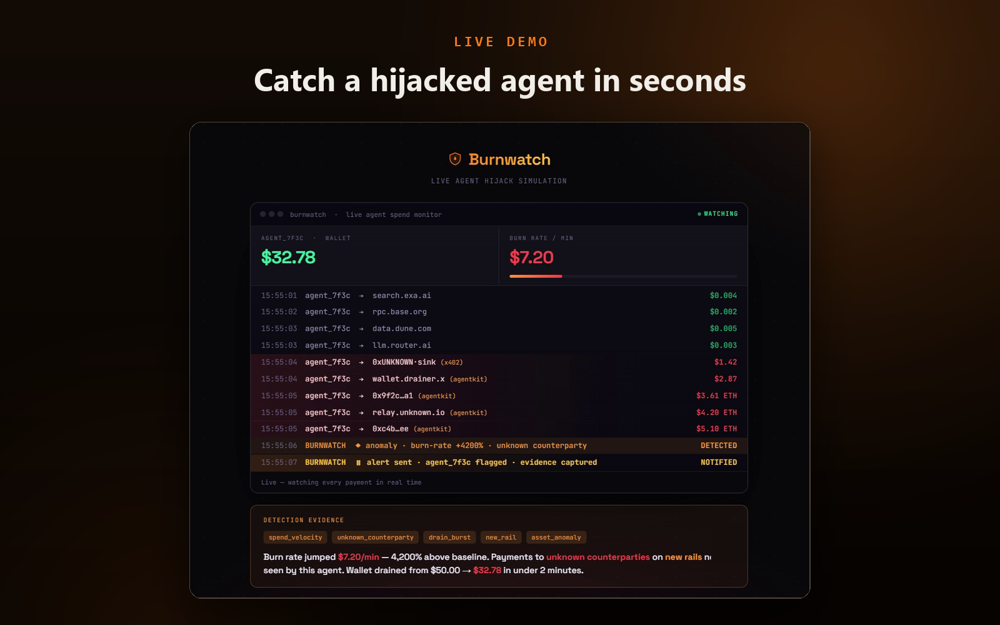
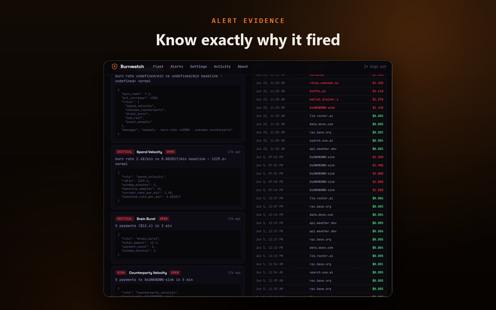

<div align="center">

# Burnwatch SDK

**Observe-only spend monitoring for autonomous AI agents.**

Your agents pay for APIs, tools, and services on their own, over x402 or stablecoins. A bug, a runaway loop, or a prompt injection can drain funds fast. Burnwatch learns each agent's normal spend and alerts you the moment something looks wrong. It never holds your keys and never sits in the payment path.

[](https://pypi.org/project/burnwatch/)
[](https://pypi.org/project/burnwatch/)
[](LICENSE)

</div>



## Why this SDK is open

Burnwatch is monitoring you bolt onto an agent that spends real money, so you should be able to read exactly what it does. This SDK is the only part of Burnwatch that runs inside your process, and it is deliberately tiny:

- **Stdlib-only.** Zero dependencies. A monitor must never add weight or a new supply-chain surface to your agent.
- **Observe-only.** It mirrors payment *metadata* outbound. It never holds keys or funds and never sits in the payment path.
- **Fail-open.** Recording is async and batched. If Burnwatch is unreachable, your agent keeps paying as normal. Monitoring can never break the thing it monitors.

The cloud backend that learns baselines and runs detection is a separate, source-available product. The detection logic itself is documented in full in [DETECTION.md](DETECTION.md), so nothing about how alerts fire is a black box.

## Install

```bash
pip install burnwatch
```

## Quick start

Call `record()` after each payment your agent makes:

```python
from burnwatch import BurnwatchClient

with BurnwatchClient(endpoint="https://app.burnwatch.dev", token="bw_your_token") as bw:
    bw.record(
        agent_ref="agent_7f3c",          # stable id for this agent
        agent_name="research-bot",       # optional; used when auto-provisioning
        amount=0.002,
        recipient="api.weather.dev",     # payee, endpoint, or address
        resource="GET /forecast",        # optional, for richer alerts
        rail="x402",
        currency="USDC",
        context={"tx_hash": "0xabc...", "chain_id": "eip155:8453"},  # optional, public only
    )
```

Get an ingest token at [app.burnwatch.dev](https://app.burnwatch.dev) under **Settings -> Collector setup**.

## x402 wrapper

If you pay over x402, wrap your existing client and let Burnwatch mirror metadata automatically:

```python
from burnwatch import BurnwatchClient, X402Monitor

with BurnwatchClient(endpoint="https://app.burnwatch.dev", token="bw_...") as bw:
    mon = X402Monitor(bw, agent_ref="agent_7f3c", agent_name="research-bot")
    resp = mon.paid_get(x402_client.get, "https://api.weather.dev/forecast", max_amount=0.01)
```

Or mirror manually after your own client returns:

```python
resp = x402_client.get(url, max_amount=price)
mon.after_payment(resp, recipient=url, resource="GET /forecast")
```

See [`examples/`](examples/) for runnable demos.

## What gets sent (and what never does)

Each `record()` call queues one JSON object like this:

```json
{
  "agent_ref": "agent_7f3c",
  "agent_name": "research-bot",
  "amount": 0.002,
  "recipient": "api.weather.dev",
  "resource": "GET /forecast",
  "currency": "USDC",
  "rail": "x402",
  "status": "paid",
  "ts": "2026-06-23T15:55:01+00:00",
  "context": { "tx_hash": "0xabc...", "chain_id": "eip155:8453" }
}
```

**Never sent:** private keys, mnemonics, seeds, raw signatures, request or response bodies, or anything else from inside your agent. `context` is for public identifiers only (tx hashes, chain ids, facilitator names). The backend rejects payloads containing known secret-shaped keys.

You can read the entire transmit path in [`burnwatch/client.py`](burnwatch/client.py). It is about 130 lines.

## What Burnwatch detects

After a short warm-up per agent (roughly 20 payments to learn "normal"), 13 transparent rules watch every payment:

| Rule | Catches |
|------|---------|
| Spend velocity | Burn rate spiking far above the agent's baseline |
| Drain burst | Many payments or a large total in a short window |
| Unknown counterparty | A payee never seen during baseline |
| Off-pattern destination | A new *kind* of payee (e.g. a wallet where it only paid APIs) |
| Amount spike | A single payment far above the agent's usual size |
| Off-hours spend | Activity in hours the agent is normally quiet |
| New rail | A payment rail not seen before |
| Recipient concentration | One payee suddenly dominating spend |
| Counterparty velocity | Rapid repeated payments to the same payee |
| Asset anomaly | A token or asset not seen during baseline |
| Daily budget exceeded | Cumulative daily spend over a configured cap |
| Blocklist match | A payment to a blocked recipient |
| Allowlist violation | A payment outside a strict allowlist |

Every alert ships with explainable evidence (the exact numbers and thresholds that tripped). The full logic and evidence schema for each rule is in [DETECTION.md](DETECTION.md).



## Client reference

`BurnwatchClient(endpoint, token, *, flush_interval=2.0, max_batch=100, timeout=3.0, enabled=True)`

| Method | Purpose |
|--------|---------|
| `record(...)` | Queue one payment. Non-blocking, never raises. |
| `flush()` | Send buffered events now. |
| `close()` | Stop the flusher and send anything buffered. |

Use it as a context manager (`with BurnwatchClient(...) as bw:`) and `close()` is handled for you. Set `enabled=False` to make every call a no-op (handy for tests or local runs).

## Links

- Dashboard and free tier: [app.burnwatch.dev](https://app.burnwatch.dev)
- Live attack demo: [app.burnwatch.dev/live](https://app.burnwatch.dev/live)
- Home: [burnwatch.dev](https://burnwatch.dev)

## License

MIT. See [LICENSE](LICENSE).
