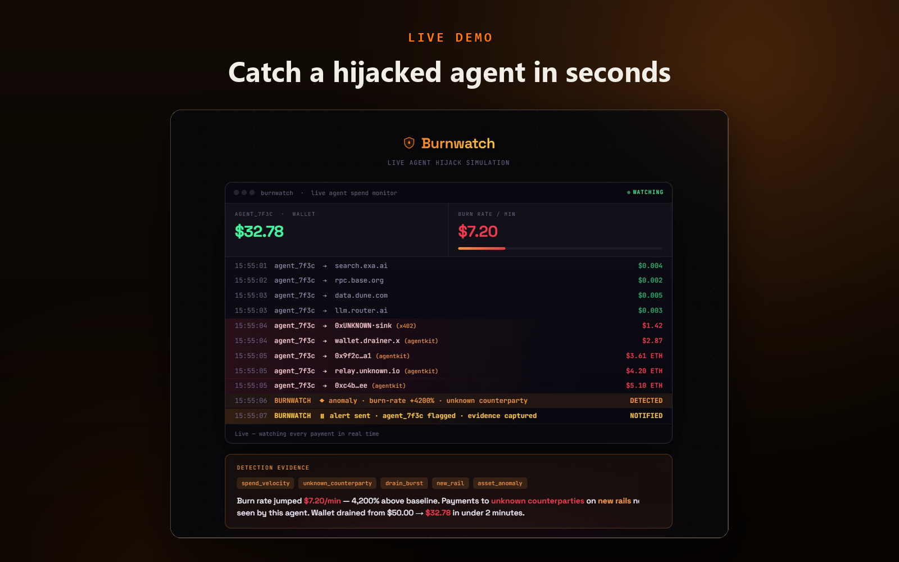
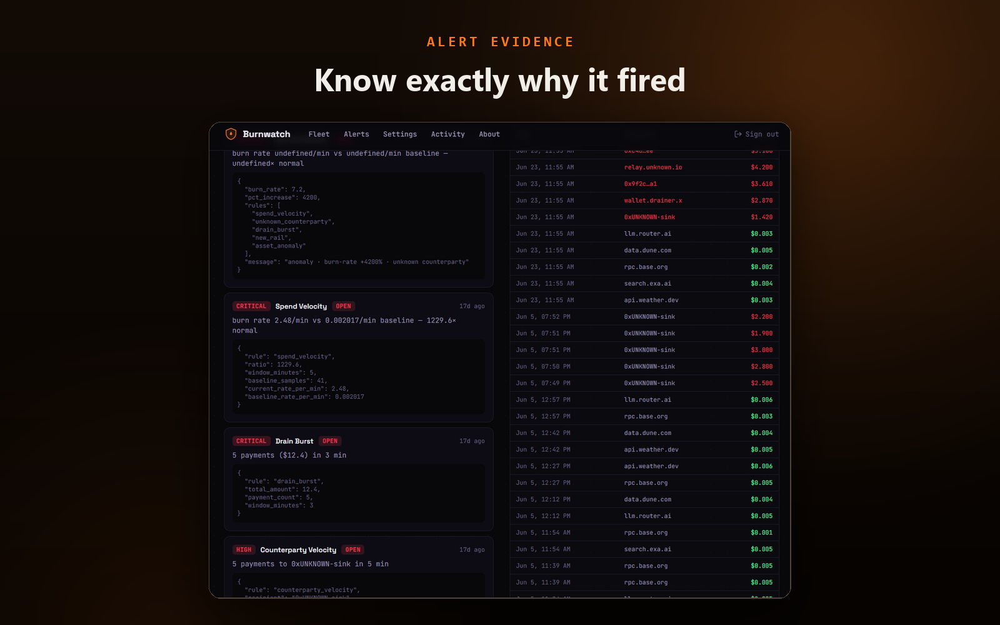

<div align="center">

# Burnwatch SDK

**Agent spend observability — API bills, tools, and onchain micropayments.**

Your agents run up real bills on their own: LLM APIs, tools, compute, and (increasingly) x402 or stablecoin payments. A bug, a runaway loop, or a prompt injection can burn a huge amount fast. Burnwatch learns each agent's normal spend and alerts you the moment something looks wrong. Wire a pause webhook if you want the loop to stop itself. It never holds your keys and never sits in the payment path unless you opt into soft-pause checks in your own process.

[](https://pypi.org/project/burnwatch/)
[](https://pypi.org/project/burnwatch/)
[](LICENSE)

</div>



## Why this SDK is open

Burnwatch is monitoring you bolt onto an agent that spends real money, so you should be able to read exactly what it does. This SDK is the only part of Burnwatch that runs inside your process, and it is deliberately tiny:

- **Stdlib-only.** Zero dependencies. A monitor must never add weight or a new supply-chain surface to your agent.
- **Observe-only.** It mirrors payment *metadata* outbound. It never holds keys or funds and never sits in the payment path.
- **Fail-open.** Recording is async and batched, and a transient outage re-queues events rather than dropping them (bounded buffer). If Burnwatch is unreachable, your agent keeps paying as normal. Monitoring can never break the thing it monitors.

The cloud backend that learns baselines and runs detection is a separate, source-available product. The detection logic itself is documented in full in [DETECTION.md](DETECTION.md), so nothing about how alerts fire is a black box.

## Install

```bash
pip install burnwatch
```

## Quick start — watch your API bill

A runaway agent that burns $900 of OpenAI tokens overnight is the same failure as a wallet drain. Wrap your LLM client once:

```python
from burnwatch import BurnwatchClient, monitor_llm

bw = BurnwatchClient(endpoint="https://app.burnwatch.dev", token="bw_your_token")
client = monitor_llm(OpenAI(), bw, agent_ref="agent_7f3c", agent_name="research-bot")
client.chat.completions.create(model="gpt-4o", messages=[...])   # cost recorded as rail=llm
```

Works with OpenAI and Anthropic (and compatible clients): duck-typed, never imports them. Costs come from a built-in price table (`set_prices()` to override). Sync, non-streaming calls are captured automatically; for streaming or async, compute `llm_cost()` and pass it to `bw.record()`. See [`examples/openai_spend.py`](examples/openai_spend.py).

Get an ingest token at [app.burnwatch.dev](https://app.burnwatch.dev) under **Settings -> Collector setup**.

## Or record any payment

```python
from burnwatch import BurnwatchClient

with BurnwatchClient(endpoint="https://app.burnwatch.dev", token="bw_your_token") as bw:
    bw.record(
        agent_ref="agent_7f3c",
        agent_name="research-bot",
        amount=0.002,
        recipient="api.weather.dev",
        resource="GET /forecast",
        rail="x402",
        currency="USDC",
        context={"tx_hash": "0xabc...", "chain_id": "eip155:8453"},
    )
```

## x402 wrapper

```python
from burnwatch import BurnwatchClient, X402Monitor

with BurnwatchClient(endpoint="https://app.burnwatch.dev", token="bw_...") as bw:
    mon = X402Monitor(bw, agent_ref="agent_7f3c", agent_name="research-bot")
    resp = mon.paid_get(x402_client.get, "https://api.weather.dev/forecast", max_amount=0.01)
```

See [`examples/`](examples/) for runnable demos — including offline LangChain / CrewAI / AgentKit starting points.

## What gets sent (and what never does)

Each `record()` call queues one JSON object like this:

```json
{
  "agent_ref": "agent_7f3c",
  "agent_name": "research-bot",
  "amount": 0.002,
  "recipient": "api.weather.dev",
  "resource": "GET /forecast",
  "currency": "USDC",
  "rail": "x402",
  "status": "paid",
  "ts": "2026-06-23T15:55:01+00:00",
  "context": { "tx_hash": "0xabc...", "chain_id": "eip155:8453" }
}
```

**Never sent:** private keys, mnemonics, seeds, raw signatures, request or response bodies, or anything else from inside your agent. `context` is for public identifiers only (tx hashes, chain ids, facilitator names). The backend rejects payloads containing known secret-shaped keys.

You can read the entire transmit path in [`burnwatch/client.py`](burnwatch/client.py). It is about 130 lines.

## What Burnwatch detects

After a short warm-up per agent (roughly 20 payments to learn "normal"), 13 transparent rules watch every payment:

| Rule | Catches |
|------|---------|
| Spend velocity | Burn rate spiking far above the agent's baseline |
| Drain burst | Many payments or a large total in a short window |
| Unknown counterparty | A payee never seen during baseline |
| Off-pattern destination | A new *kind* of payee (e.g. a wallet where it only paid APIs) |
| Amount spike | A single payment far above the agent's usual size |
| Off-hours spend | Activity in hours the agent is normally quiet |
| New rail | A payment rail not seen before |
| Recipient concentration | One payee suddenly dominating spend |
| Counterparty velocity | Rapid repeated payments to the same payee |
| Asset anomaly | A token or asset not seen during baseline |
| Daily budget exceeded | Cumulative daily spend over a configured cap |
| Blocklist match | A payment to a blocked recipient |
| Allowlist violation | A payment outside a strict allowlist |

Every alert ships with explainable evidence (the exact numbers and thresholds that tripped). The full logic and evidence schema for each rule is in [DETECTION.md](DETECTION.md).



## Soft pause — recommended response loop

Burnwatch is observe-first on purpose: it never sits in your payment path by default and never holds your keys, so monitoring can't slow or break your agent. To close the loop when something looks wrong:

1. Dashboard → **Settings → Alert delivery** → add a JSON webhook URL.
2. Run [`examples/killswitch.py`](examples/killswitch.py) (or copy it) and point the webhook at that receiver.
3. Replace `pause_agent()` with whatever actually stops spend (feature flag, revoke allowance, kill process).

Optionally poll `should_pause(agent_ref)` from the SDK before your next payment (fail-open if Burnwatch is unreachable). Routing to on-call instead? [`examples/pagerduty_relay.py`](examples/pagerduty_relay.py).

## Client reference

`BurnwatchClient(endpoint, token, *, flush_interval=2.0, max_batch=100, timeout=3.0, enabled=True)`

| Method | Purpose |
|--------|---------|
| `record(...)` | Queue one payment. Non-blocking, never raises. |
| `should_pause(agent_ref)` | Soft-pause check (cached, fail-open). |
| `flush()` | Send buffered events now. |
| `close()` | Stop the flusher and send anything buffered. |

Use it as a context manager (`with BurnwatchClient(...) as bw:`) and `close()` is handled for you. Set `enabled=False` to make every call a no-op (handy for tests or local runs).

## Links

- Dashboard and free tier: [app.burnwatch.dev](https://app.burnwatch.dev)
- Live attack demo: [app.burnwatch.dev/live](https://app.burnwatch.dev/live)
- Home: [burnwatch.dev](https://burnwatch.dev)

## License

MIT. See [LICENSE](LICENSE).
